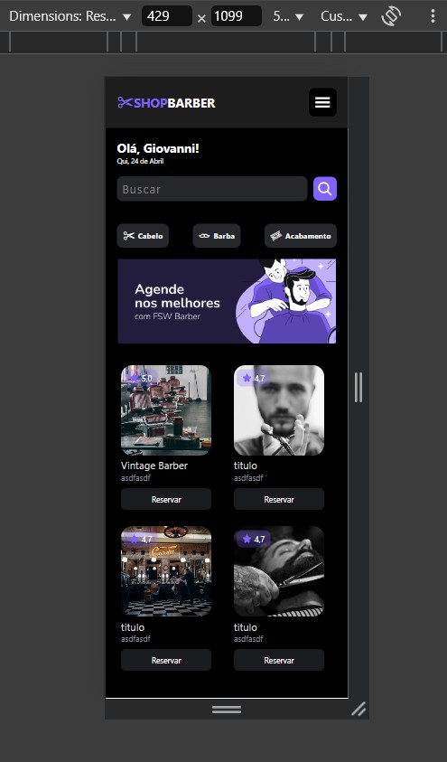

### Projeto em EXPO com React

* TypeScript

* Expo Router

* Expo Media Query

### Telas prontas

* Tela de Login


* Tela de Cadastro


* Tela de Perfil


* Tela de Home



### Menu Drawer

* Doc

```
https://docs.expo.dev/router/advanced/drawer/
```

```
npx expo install @react-navigation/drawer react-native-gesture-handler react-native-reanimated
```

